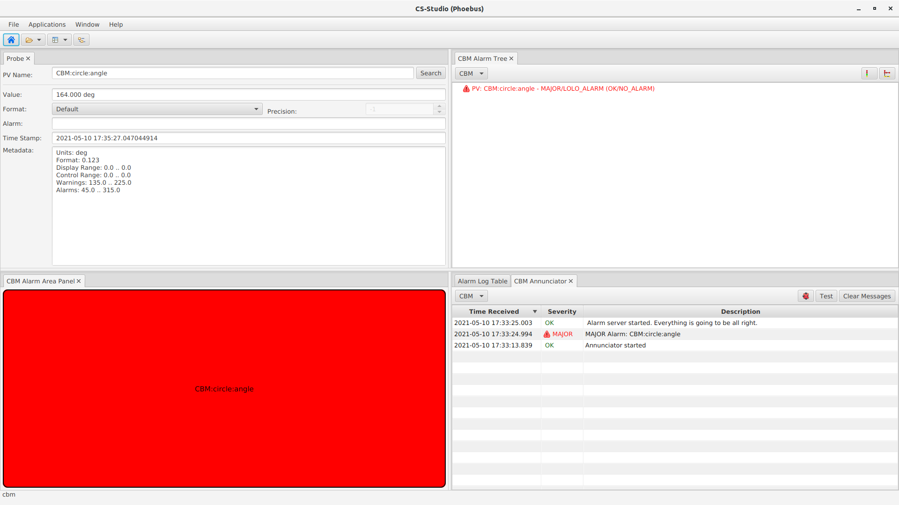

Howto
=====================================================

After cloning the repository it's important to adjust the environment variables located in the .env file (LOC and SUBSYSTEM).
The first of them points to the directory to which you've downloaded the DCS.
Second one assigns names to kafka topics and serves as a configuration name for alarm-server.

To run all included services use startup script with two arguments describing your subsystem and name of the alarm configuration file which should be located in config/Alarmconfig folder.
To run the example type:

    .. code:: bash

        ./startup.sh CBM example
        
        
To stop:

    .. code:: bash

        docker-compose -f docker-compose-aa.yml down

Remember that all the service listed in the depends_on line will be deployed subsequently. That's why it's important to carefully choose the services you want to deploy.

Before deploying, you may also want to carefully check the repositories in which you want to store the db files. In this case, they will appear in the DCS folder.

The startup procedure may last up to a few minutes. If it is successful, you will see the screen below.

    

What's the purpose?
--------------------

